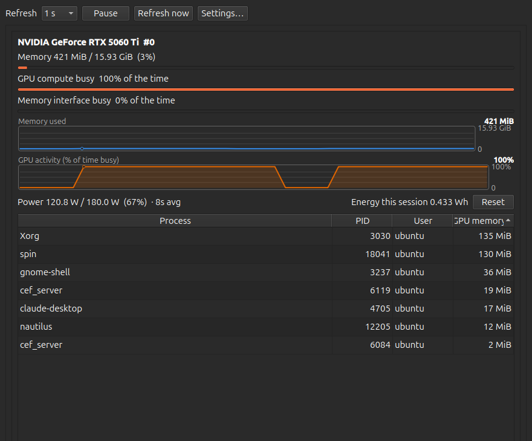

# GPUM 📊

**A friendly, live view of what your GPU is actually doing** — memory, activity, power, and the
processes using it, refreshing every second without ever freezing on you.

👋 New here? You only need two commands to be up and running. Jump to
[Get started](#-get-started) and you'll have it open in under a minute.

🔒 **Read-only. No root needed. Nothing ever leaves your machine.**



*A real capture, not a mockup: a CUDA kernel was started, stopped, and started again while the
window sampled — that is the plateau, dip, and second plateau in the activity graph, with the
kernel (`spin`) still running and holding compute at 100% at the moment of capture.*

---

## 🚀 Get started

The easiest way is the **AppImage**: one self-contained file with Python and Qt already inside.
Nothing to install, nothing to uninstall — delete the file and it's gone. 🎉

### 1️⃣ Download it

Grab `GPUM-0.1.0-x86_64.AppImage` from the
[**releases page**](https://github.com/rs-r2d2/gpum/releases) 📥, or straight from your terminal:

```bash
curl -L -O https://github.com/rs-r2d2/gpum/releases/download/v0.1.0-alpha.2/GPUM-0.1.0-x86_64.AppImage
```

> 💡 **Use the version tag, not `latest`.** Releases so far are marked *pre-release*, and
> GitHub's `/releases/latest/` link skips those — so a `latest` URL gives you a **404** instead of
> a download. Check the releases page for the newest tag.

### 2️⃣ Allow it to run

```bash
chmod +x GPUM-0.1.0-x86_64.AppImage
```

> ⚠️ **Don't skip this one!** Anything you download arrives *without* permission to run — your
> browser and `curl` can't know whether you meant to open a file or execute a program, so Linux
> plays it safe and waits for you to say so. `chmod +x` is you saying so.
>
> Without it, nothing helpful happens: the terminal says
> `bash: ./GPUM-0.1.0-x86_64.AppImage: Permission denied`, and double-clicking in your file
> manager either opens an archive viewer or does nothing at all. Neither one mentions
> permissions, which is why this catches almost everybody once. 🙂

### 3️⃣ Open it

```bash
./GPUM-0.1.0-x86_64.AppImage
```

That's it — your GPUs should appear straight away. ✨

**Want it in your applications menu?** Install the pip package below and run
`gpum --install-desktop-entry`, or just pin the AppImage to your dock.

### ✅ What you'll need

| | |
|---|---|
| 🐧 **Linux, 64-bit x86** | Ubuntu 22.04 or newer, or anything with glibc 2.35+ |
| 🎮 **An NVIDIA driver** | already installed — the one you already use for graphics is fine |
| 💾 **~50 MB of disk** | that's the whole thing |

> 🧐 **Why the driver isn't bundled:** NVIDIA's libraries are locked to your running kernel
> module. A copy shipped inside the AppImage would either refuse to load or — much worse —
> quietly report *the build machine's* numbers as if they were yours. So GPUM asks your system
> for them instead. Honest beats convenient. 🙏

---

## 🐍 Prefer pip?

Just as supported, and handy if you already live in Python:

```bash
pip install -e ".[nvidia]"        # recommended
pip install -e "."                # also fine — NVIDIA support then reports as not installed
```

```bash
gpum                              # launch it
gpum --install-desktop-entry      # add it to your applications menu 📌
```

Python 3.11+, no compiler required. Both forms share the same settings file, so switch between
them whenever you like — your preferences follow you. 👍

---

## 🖥️ Using GPUM

### Reading the window

Each GPU gets its own panel with **three bars** — memory used, GPU compute activity, and memory
interface activity — followed by **two trend graphs**. 📈

Each graph tells you its own scale, so you're never guessing: the label sits on the left, the
**current value in bold** on the right, and the ceiling and floor down the right-hand edge. The
memory graph is scaled to your card's capacity; the activity graph to a flat 0–100%.

> 🎯 **One number worth understanding:** "GPU compute busy 100% of the time" means the GPU was
> *doing something* the whole sampling period — **not** that all its cores were saturated. A
> single small kernel can pin it at 100%. Hover the label and GPUM tells you exactly that,
> because this is the figure people most often read as something it isn't.

### Controls along the top

| Control | What it does |
|---|---|
| ⏱️ **Refresh** | How often to sample — 0.5 s up to 10 s |
| ⏸️ **Pause** | Freeze the display; nothing is sampled while paused |
| 🔄 **Refresh now** | Take one sample immediately |
| ⚙️ **Settings…** | Everything below |

### In Settings ⚙️

- ⏱️ **Refresh every** — 0.5 s, 1 s, 2 s, 5 s, or 10 s
- 📜 **Keep history for** — 1 minute up to 1 hour, which sets how far the graphs look back
- 🔋 **Slow updates while the window is hidden** — kind to your battery
- 🗂️ **Keep GPUM in the status area when the window is closed** — tuck it into the tray
- 🌅 **Start GPUM when I log in**

### The process table

Click any column header to sort — **process, PID, user, or GPU memory**. 🖱️ Rows whose value
can't be measured always sort to the bottom, in both directions, so they never masquerade as
zeros.

### Just want a look around? 🧪

No GPU needed — GPUM ships simulated ones:

```bash
gpum --backend fake                       # two healthy GPUs
gpum --backend fake --scenario mig-device  # try a specific situation
gpum --list-scenarios                      # see all eight
```

Handy scenarios: `two-nvidia` (the happy path), `processes-churn`, `one-device-hangs`,
`no-attribution`, `multi-vendor-degraded`, and `empty`. The AppImage takes these flags too.

---

## ✨ What you get

**For every GPU**

- 💾 **Memory used vs total** — as a bar and as a trend graph scaled to the card's capacity.
- ⚡ **GPU compute activity** — the share of *time* the GPU was busy, with its own bar and graph.
- 🔀 **Memory interface activity** — how busy the path to memory was, which moves independently
  of both compute activity and memory occupancy. Labelled by what it describes, so it can't be
  confused with the memory figure just above it.
- 🔌 **Power draw vs the enforced limit**, plus energy used this session.
- 📋 **The processes using the GPU** — name, PID, owner, and per-process memory, all sortable.

**Across the window**

- 🎛️ Adjustable refresh interval, pause, and refresh-now.
- 🖥️ Multiple GPUs, each in its own panel.
- 😴 Suspend and resume leave an honest gap in history, never a fabricated straight line.
- 🔔 Optional tray icon and start-at-login.

**About those trend graphs:** percentages use a fixed 0–100 scale, so an idle GPU's 0–3% noise
stays at the bottom instead of being stretched to full height — and two GPUs stay comparable
side by side. A stretch that couldn't be read is drawn as a **break in the line**, never a drop
to zero. Line and label colours are checked against whatever background they land on and
corrected if they fall short, in light themes and dark ones alike. 🎨

---

## 🧯 Troubleshooting

**`Permission denied` when I run it** 🔑
You skipped `chmod +x GPUM-0.1.0-x86_64.AppImage`. Easy fix, and see step 2️⃣ above for why it's
needed.

**Double-clicking it does nothing, or opens an archive viewer** 🖱️
Same cause as above — it isn't marked executable yet. Some file managers also need
*Properties → Permissions → Allow executing file as program*.

**The download link gives me a 404** 🔗
You're probably using a `/releases/latest/` URL. Current releases are pre-releases, which that
link deliberately skips. Use the explicit version tag, or grab it from the
[releases page](https://github.com/rs-r2d2/gpum/releases).

**It says "No GPUs are available to monitor"** 🔍
GPUM will list what it looked for and why each option didn't work, right in the window. Usually
the NVIDIA driver isn't installed or isn't loaded — check with `nvidia-smi`. If that fails too,
it's a driver matter rather than a GPUM one. GPUM stays open and usable either way. 👍

**It won't start on an older distribution** 📦
The AppImage needs glibc 2.35+ (Ubuntu 22.04 and newer). On something older, use the pip package
instead.

**Per-process memory shows as unavailable** 🤔
Some driver setups report the PIDs but not their memory. GPUM says so explicitly rather than
printing `0`, because `0` would look like a process using no GPU memory at all.

**Something else?** Please [open an issue](https://github.com/rs-r2d2/gpum/issues) — genuinely
happy to help. 💬

---

## 🤝 What GPUM promises you

- 🚫 **It never invents a number.** Every metric is either a real measurement or is shown as
  explicitly unavailable *with a reason*. Nothing missing is rendered as `0`, and a gap in a
  trend graph is drawn as a gap, not a dip to zero.
- 🧊 **It never freezes.** All sampling happens off the interface thread with per-device
  timeouts. One wedged driver degrades one device; everything else keeps updating and the window
  stays responsive.
- ✋ **It never changes anything.** No killing processes, no clock, power, or fan changes. The
  only thing it writes is your own preferences.
- 🔐 **It never phones home.** No telemetry, no network access of any kind.

---

## 💻 Supported hardware

**Linux and NVIDIA.** 🐧🟩 AMD and Intel are registered but not implemented — they say so
plainly in the window rather than pretending. See
[docs/capability-matrix.md](docs/capability-matrix.md) for the full picture of what's verified.

Windows and macOS aren't supported or planned. GPUM is vendor-agnostic by design but
single-platform by scope — the backend abstraction is real and load-bearing; the platform
ambition was dropped (constitution 2.0.0).

---

## 🛠️ Contributing

Contributions are very welcome. 💚

```bash
pip install -e ".[dev]"
pytest                    # full suite — passes with no GPU present
pytest -m hardware        # needs a real NVIDIA GPU
ruff check src tests
```

A failing `tests/unit/test_import_boundaries.py` is a constitution violation, not a style nit:
it means the vendor or platform abstraction has been breached. Fix the import; don't relax the
test.

Design documents live in [specs/001-gpu-usage-monitor/](specs/001-gpu-usage-monitor/), and the
principles the code is held to are in
[.specify/memory/constitution.md](.specify/memory/constitution.md).
